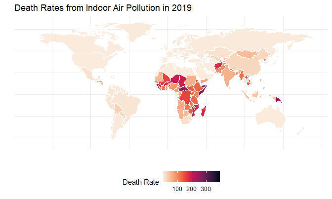
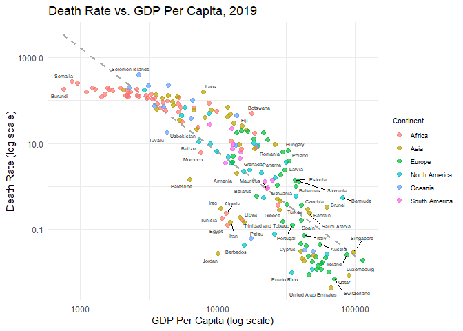

DSA2101 Group Project: The Variation of Indoor Air Pollution Across
Different World Regions
================
Indoor Air Pollution, 96659
2024-08-14

<br> **Load necessary packages and download data required:**

``` r
library(tidyverse)
library(readxl)
library(stringr)
library(lubridate)
library(viridis)
library(maps)
library(ggrepel)
fuel_access <- readr::read_csv('https://raw.githubusercontent.com/rfordatascience/tidytuesday/master/data/2022/2022-04-12/fuel_access.csv')
fuel_gdp <- readr::read_csv('https://raw.githubusercontent.com/rfordatascience/tidytuesday/master/data/2022/2022-04-12/fuel_gdp.csv')
death_source <- readr::read_csv('https://raw.githubusercontent.com/rfordatascience/tidytuesday/master/data/2022/2022-04-12/death_source.csv')
death_fuel <- readr::read_csv('https://raw.githubusercontent.com/rfordatascience/tidytuesday/master/data/2022/2022-04-12/death_fuel.csv')
death_timeseries <- readr::read_csv('https://raw.githubusercontent.com/rfordatascience/tidytuesday/master/data/2022/2022-04-12/death_timeseries.csv')
indoor_pollution <- readr::read_csv('https://raw.githubusercontent.com/rfordatascience/tidytuesday/master/data/2022/2022-04-12/indoor_pollution.csv')
```

## 1. Introduction

For this project, we shall focus on the [“Indoor Air Pollution”
dataset](https://github.com/rfordatascience/tidytuesday/blob/master/data/2022/2022-04-12/readme.md)
from the TidyTuesday repository, published on 12 April 2022. Taken from
“Our World in Data”, this dataset contains information about the extent
of indoor air pollution across the globe. The data also provides us with
other details about the countries of the world, which are factors that
could affect the severity of indoor air pollution within a country’s
borders.

The “Indoor Air Pollution” dataset contains the following files:

- **fuel_access.csv**: For each country, this file contains historical
  data on the percentage level of access to clean fuels and technologies
  for cooking  
- **fuel_gdp.csv**: For each country, this file contains historical data
  on the percentage level of access to clean fuels and technologies for
  cooking, the Gross Domestic Product (GDP) per capita, the total
  population, as well as the continent that the country is in  
- **death_source.csv**: For each country, this file contains historical
  data on the death rate associated with indoor air pollution
  - Note: The death rate is determined by carrying out age and
    population standardisation. Since different countries have different
    demographics, the standardisation of age and population enables
    these death rates to be comparable across different countries  
- **death_timeseries.csv**: For each country, this file contains
  historical data on the absolute death count associated with indoor air
  pollution (with comparison to the death count in 2019), as well as the
  continent that the country is in  
- **death_fuel.csv**: Contains the same information as
  **death_timeseries.csv**  
- **indoor_pollution.csv**: For each country, this file contains
  historical data on the percentage of deaths associated with indoor air
  pollution

We wish to explore how and why indoor air pollution varies across
different world regions. This problem statement was chosen, based on our
understanding that indoor air pollution is a widespread problem which
has severe consequences on a global scale. Therefore, we need to quickly
pinpoint hotspots that are most greatly affected by indoor air
pollution, which correspond to regions that require the most assistance.
After identifying reasons for the vulnerability in these places, we can
then swiftly begin to formulate solutions. By offering aid to these
target areas as quickly as possible, we are able to minimise the damage
of indoor air pollution in the most effective manner.

To carry out our investigation, we shall create the following plots:

1.  A world map illustrating the death rates associated with indoor air
    pollution, across the countries of the world  
2.  A scatter plot of death rate associated with indoor air pollution,
    against GDP per capita (with colour mapping based on continent)  
3.  A line graph of access to clean fuels and technologies for cooking,
    against time (with one line for each continent)

For this, we will only make use of **death_timeseries.csv**,
**fuel_gdp.csv** and **death_source.csv** as our CSV files of choice.

## 2. General Data Cleaning

Within our plots, we intend to categorise countries according to
continent. In **death_timeseries.csv**, for each row that does not
contain `NA` values, each country is labelled with its respective
continent. Hence, we can use this file to produce
`countries_and_continents`, a data frame which points each country to
its corresponding continent.

We are choosing to use death rate as our metric for the severity of
indoor air pollution. This is because the death rate is a standardised
quantity, as opposed to the absolute death count, which makes it more
useful for comparison across different countries. Now, we can add the
continents of each country to **death_source.csv**, by left-joining it
with `countries_and_continents`. After removing unnecessary rows, we
obtain a data frame `death_rates`, which contains the death rates of
each country from 1990 to 2019.

From **fuel_gdp.csv**, we can remove unnecessary rows and columns to
obtain `access_and_gdp`, which contains the access percentages and GDP
per capita of each country from 1990 to 2019 (though there are `NA`
values for some years).

Finally, we left-join `death_rates` with `access_and_gdp` to obtain
`data`, the final data frame used for analysis. In `data`, most
countries have data on death rate and GDP per capita for the year 2019
(most recent year). However, access percentages only range from year
2000 to year 2016 for most countries. Hence, to minimise `NA` values,
the world map and scatter plot created will focus on 2019 data, while
the line graph will focus on data from 2000 to 2016.

``` r
# countries_and_continents contains countries along with their corresponding continents
countries_and_continents <- death_timeseries %>%
                            select(Entity, Code, Continent) %>%
                            drop_na()

# death_rates contains death rates for each country (with corresponding continent), over time
death_rates <- left_join(death_source, countries_and_continents, by = c("Entity", "Code")) %>%
               drop_na() %>%
               relocate(Continent, .before = Year)

# access_and_gdp contains clean fuel access rates and GDP per capita for each country, over time (there are some NA values)
access_and_gdp <- fuel_gdp %>%
                  select(-c(`Population (historical estimates)`, Continent)) %>%
                  filter(Year >= 1990, Year <= 2019, !is.na(Code))

# data contains the final data used for analysis. Note that data ranges from 1990 to 2019. For plot 3, can consider focusing on 2000 to 2016 only, so as to minimise NA values in "access to clean fuels" column
data <- left_join(death_rates, access_and_gdp, by = c("Entity", "Code", "Year")) %>%
        rename(Country = Entity, `Death Rate` = `Deaths - Cause: All causes - Risk: Household air pollution from solid fuels - Sex: Both - Age: Age-standardized (Rate)`, `GDP per capita (constant 2017 international $)` = `GDP per capita, PPP (constant 2017 international $)`)
```

## 3. Data Visualisations

### Plot 1: World Map

Our first plot - the world map of death rates from indoor air
pollution - serves two key purposes. Firstly, it helps us in
**identifying areas of concern**. World maps are excellent tools for
showing geographic variations, as we are able to easily identify regions
suffering from the highest levels of indoor air pollution. Secondly, it
**guides our further investigations**. This initial overview allows us
to focus our subsequent efforts on testing our hypotheses and exploring
the “why” behind such patterns.

In the cleaning process, we identified countries in the world map data
with names that were not consistent with our data, hence we used a
custom name function `change_names()` to standardise them. We then
filtered out the data to include only data for 2019, countries that have
its geographical coordinates in the world map data and kept only
variables of interest (Country and Death Rate). Finally, we merged our
data with the world map based on country names, creating the final
dataset `map` for our visualisation. To ensure a clear and intuitive
visualisation, we coloured countries according to death rates, with more
intense colours representing higher death rates to highlight the
severity of the issue.

``` r
change_names <- function(country) {
  return(case_when(
         country %in% c("Antigua", "Barbuda") ~ "Antigua and Barbuda",
         country %in% c("Saint Kitts", "Nevis") ~ "Saint Kitts and Nevis",
         country %in% c("Saint Vincent", "Grenadines") ~ "Saint Vincent and the Grenadines",
         country %in% c("Trinidad", "Tobago") ~ "Trinidad and Tobago",
         country == "Republic of Congo" ~ "Congo",
         country == "Ivory Coast" ~ "Cote d'Ivoire",
         country == "Czech Republic" ~ "Czechia",
         country == "Democratic Republic of the Congo" ~ "Democratic Republic of Congo",
         country == "Swaziland" ~ "Eswatini",
         country == "Micronesia" ~ "Micronesia (country)",
         country == "Timor-Leste" ~ "Timor",
         country == "UK" ~ "United Kingdom",
         country == "USA" ~ "United States",
         TRUE ~ country
        ))
}

world <- map_data("world") %>%
         mutate(region = change_names(region))
map <- data %>%
       filter(Year == 2019, !(Country %in% c("Tokelau", "Tuvalu", "United States Virgin Islands"))) %>%
       select(Country, `Death Rate`) %>%
       left_join(world, by = c("Country" = "region"))

ggplot(data = map) +
  geom_polygon(aes(x = long, y = lat, group = group, fill = `Death Rate`), color = "white") +
  scale_fill_viridis(name = "Death Rate", option = "rocket", direction = -1, na.value = "white") +
  labs(title = "Death Rates from Indoor Air Pollution in 2019", x = "", y = "") +
  theme_minimal() +
  theme(axis.text = element_blank(), axis.ticks = element_blank(), legend.position = "bottom")
```



### Plot 2: Scatter Plot

From the first plot, it is evident that countries in the African
continent are more severely affected by indoor air pollution. Since
Africa is known to have a higher proportion of developing countries, we
developed the second plot to investigate the relationship between the
severity of indoor air pollution, represented by the death rates of
countries, against the level of affluence, represented by GDP per
capita.

In the cleaning process, we created a new dataframe titled `data_plot2`
by removing missing values, filtering data from the year 2019 and
isolating the variables we require for this plot. We then created a
scatter plot by mapping different colours to the points based on their
continents, which helps to relate to the topic in the problem statement
about geographical regions. To ensure an even distribution of the
points, we transformed both the x and y-axis values to logarithmic
scale. Text labels indicating the names of certain countries are also
included as additional information to facilitate intra-continent and
inter-continent comparison. This provides greater nuance as the level of
affluence of countries within the same continent also lies on a
spectrum. Lastly, a simple regression line was added to highlight the
linear relationship between the variables.

``` r
# focusing on 2019 
data_plot2 <- data %>%
  rename("GDP_per_capita" = `GDP per capita (constant 2017 international $)`) %>%
  filter(Year == 2019, !is.na(GDP_per_capita), !is.na(`Death Rate`)) %>%
  select(Country, Code, Continent, `Death Rate`, GDP_per_capita)

options(scipen = 999)
ggplot(data_plot2, aes(x = GDP_per_capita, y = `Death Rate`)) +
  geom_smooth(method = "lm", se = FALSE, linetype = 2, color = "darkgrey") +
  geom_point(aes(color = Continent), alpha = 0.7, size = 2) +
  geom_text_repel(aes(label = Country), size = 1.9) +
  scale_x_log10() +
  scale_y_log10() +
  labs(x = "GDP Per Capita (log scale)", y = "Death Rate (log scale)", title = "Death Rate vs. GDP Per Capita, 2019") +
  theme_minimal() +
  theme(legend.key.size = unit(0.5, "cm"),
  legend.title = element_text(size = 8),
  legend.text = element_text(size = 7))
```



### Plot 3: Line Graph

From previous analyses, we can conclude that poorer countries suffer
more greatly from indoor air pollution. Now, we hypothesise that this
might be because developing countries tend to have a lower proportion of
clean fuels and technologies for cooking - burning of unclean fuels and
technologies for cooking contributes to indoor air pollution. To test
this, we developed a third plot to find out if there is a link between
the level of access to clean fuels and technologies for cooking and the
severity of indoor air pollution experienced.

We created a new data frame titled `data_plot3` by filtering for data
from years 2000 to 2016, so as to minimise `NA` values in the “access to
clean fuels” column. Since we are using data from 2000 to 2016, the use
of a line graph would be effective to see the trend of access to clean
fuels and technologies for cooking over the years. It also allows for
easier comparison between multiple continents on the same plot. With the
use of different colours for different continents, it makes it easier
for viewers to distinguish between them. From there, we are able to find
out whether or not the accessibility to clean fuels and technologies is
a systemic problem in continents that suffer from higher severity of
indoor air pollution. This may help to explain why Africa is still
suffering from high death rates due to indoor air pollution in 2019, as
seen in the first plot.

``` r
# focusing on 2000 to 2016 only, so as to minimise NA values in "access to clean fuels" column
data_plot3 <- data %>%
  filter(Year >= 2000 & Year <= 2016) %>%
  group_by(Year, Continent) %>%
  summarise(avg_percentage_access_to_clean_fuels_and_tech_for_cooking = mean(`Access to clean fuels and technologies for cooking (% of population)`, na.rm = TRUE), .groups = "drop")

names <- filter(data_plot3, Year == 2016) %>%
  mutate(avg_percentage_access_to_clean_fuels_and_tech_for_cooking = if_else(Continent == "South America", 88, avg_percentage_access_to_clean_fuels_and_tech_for_cooking))

ggplot(data_plot3, aes(x = Year, y = avg_percentage_access_to_clean_fuels_and_tech_for_cooking)) +
  geom_line(aes(color = Continent), show.legend = FALSE, size = 1) +
  labs(x = "", y = "", title = "Average Access to Clean Fuels (% Population) by Continent") +
  geom_text(data = names, aes(label = Continent), hjust = "left", nudge_x = 0.3, size = 3, color = "black") +
  scale_x_continuous(breaks = seq(2000, 2016, by = 4), limits = c(2000, 2020)) +
  scale_y_continuous(breaks = seq(0, 100, by = 20), limits = c(0, 100)) +
  theme_minimal() 
```


## 4. Discussion

### Plot 1: World Map

The world map clearly shows a disparity in death rates from indoor air
pollution across different regions. Africa emerges as a continent with
some of the highest death rates, with many of its countries depicted in
darker shades on the map. Specifically, countries like Somalia and the
Central African Republic stand out with particularly high death rates
ranging around 300. This suggests a critical need for interventions and
improvements in these regions. While Africa is a major cause for
concern, several other countries also show concerning death rates. These
include Papua New Guinea, Afghanistan, Pakistan, Myanmar, Laos and
Cambodia. Further investigation into the contributing factors in these
identified regions is crucial.

### Plot 2: Scatter Plot

The downward sloping linear regression line distinctly showcases the
negative correlation between death rate and GDP per capita. It is also
observed that African countries are clustered closer together and have
comparatively lower GDP per capita than other continents. They also
happen to have the highest death rates. This demonstrates that most
African countries do not deviate greatly from one another in terms of
affluence and low GDP per capita may be one of the contributing factors
to indoor air pollution. This may be due to the general lack of access
to good quality resources and infrastructure to prevent and regulate
pollution on a large scale, which exacerbated the harmful effects of
pollution on human health.

### Plot 3: Line Graph

The line graph shows that the average access to clean fuels and
technologies for cooking was increasing steadily across continents from
2000 to 2016, without fluctuating much. Moreover, there is a large
disparity between Africa and Europe, indicating that a persistent lack
of access to clean fuels and technologies may be a systemic problem that
has plagued Africa historically. This could have led to the continued
production of indoor air pollution in Africa, which eventually resulted
in more deaths as observed in the first plot. Conversely, Europe has the
highest access to clean fuels and technologies for cooking across the
years - indoor air pollution from the burning of these cleaner fuels
occurs to a smaller extent, explaining why the first plot shows that
Europe has a correspondingly lower death rate. This may be related to
the fact that Africa is a poorer region with more developing countries,
which tend to have lower access to clean fuels and technologies for
cooking as compared to Europe - a more prosperous region with more
developed countries, and thus a higher access to clean fuels and
technologies.

## 5. Conclusion

In conclusion, our analysis has shown that the impacts of indoor air
pollution are most pronounced in developing nations, such as African
countries. We propose that this could likely be associated with the fact
that these regions have a lower GDP per capita, as well as a lower
access to clean fuels and technologies for cooking. While we have
identified the correlation of these factors with indoor air pollution,
the corresponding causal relationships have not been proven. Moving
forward, more can be done to confirm that these factors are indeed
responsible for the worsening of indoor air pollution, in these parts of
the world.

## 6. References

- Hannah Ritchie and Max Roser (2022) - “Indoor Air Pollution” Published
  online at [OurWorldInData.org](https://ourworldindata.org/). Retrieved
  from: <https://ourworldindata.org/indoor-air-pollution> \[Online
  Resource\]

## 7. About

This project was developed for DSA2101 Essential Data Analytics Tools:
Data Visualisation at the National University of Singapore (NUS). The
team is comprised of the following members:

| Name                | Year | Major                      | Responsibilities                                                     |
|:--------------------|:-----|:---------------------------|:---------------------------------------------------------------------|
| Celine Tan Yen Xiu  | 2    | Data Science and Economics | Plot 3 code, discussion and analysis                                 |
| Chia Bing Xuan      | 2    | Data Science and Analytics | Plot 1 code, write-up for introduction, data cleaning and conclusion |
| Lim Zhi Xin         | 2    | Data Science and Analytics | General data cleaning code, Plot 1 discussion and analysis           |
| Tiffany Lam Wan Kei | 2    | Data Science and Economics | Plot 2 code, discussion and analysis                                 |
